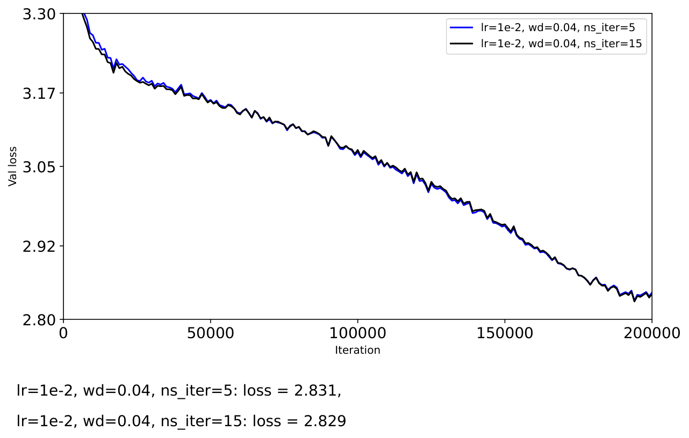

# ICML Rebuttal Figures

#### Figure 1. $X=U\Sigma^{p} V^\top$, with $p=0$. The black curve shows the training result with weight decay set to 0. The blue curve shows the training result with weight decay set to 0.06, and the red curve shows the training result after further applying QKNorm. The value 0.06 is chosen according to $0.06 \approx \frac{0.004\times 0.1}{0.007}$. Weight decay is set up based on the learning rate and the weight decay in the original Adam ($p=1$).

#### Figure 2. $X=U\Sigma^{p} V^\top$, with $p=1/4$. The black curve shows the training result with weight decay set to 0. The blue curve shows the training result with weight decay set to 0.02, and the red curve shows the training result after further applying QKNorm. The value 0.02 is chosen according to $0.02 = \frac{0.004\times 0.1}{0.02}$.

#### Figure 3. $X=U\Sigma^{p} V^\top$, with $p=1/2$. The black curve shows the training result with weight decay set to 0. The blue curve shows the training result with weight decay set to 0.04, and the red curve shows the training result after further applying QKNorm. The value 0.04 is chosen according to $0.04 = \frac{0.004\times 0.1}{0.01}$.

#### Figure 4. $X=U\Sigma^{p} V^\top$, with $p=1$. The black curve shows the training result with weight decay set to 0. The blue curve shows the training result with weight decay set to 0.1, and the red curve shows the training result after further applying QKNorm.

#### Figure 5. Ablation study on the number of Newton-Schulz (NS) iterations $K$. We observe that the training curves for $K=5$ and $K=15$ almost overlap.

